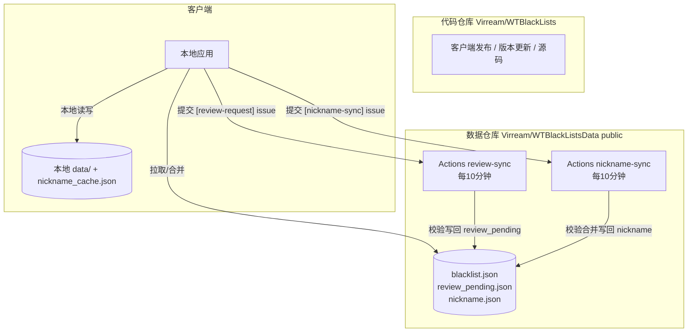

# WTBlackList — 战争雷霆陆战黑名单助手 · 功能与实现逻辑文档

> 版本对应: v2.0.2
> 本文档介绍软件的所有功能及其背后的实现逻辑, 便于理解与二次开发。

---

## 1. 软件概述

WTBlackList 是一款面向《战争雷霆》(War Thunder) 陆战的本地黑名单辅助工具。核心能力:

- **实时识别对局内玩家**并比对本地黑名单,命中时**在游戏内弹出叠加层告警**;
- 根据玩家 ID 从 **War Thunder Live / 官网 / 浏览器**自动抓取并维护昵称;
- 支持**共享黑名单/昵称表**(公开 GitHub 仓库),实现玩家之间的数据互通;
- 完整的**黑名单管理、证据管理、导入导出、审核**流程。

架构特点:**本地优先 (local-first) + 中心化公开服务**。客户端本地存储全部数据,离线可用;网络只用于同步/抓取/审核。

---

## 2. 总体架构与数据流



### 2.1 数据与代码分离

- **代码仓库** `Virream/WTBlackLists`:存放客户端源码、打包脚本、发布流程,负责版本更新与 Release。
- **数据仓库** `Virream/WTBlackListsData`(public):存放全部共享数据(`blacklist.json` / `review_pending.json` / `nickname.json`)及服务端脚本、Actions。
- 客户端 `settings.DEFAULT_REPO` 已指向数据仓库;拉取/上传/审核全部走数据仓库。

### 2.2 数据通道

| 通道 | 用途 | 说明 |
|---|---|---|
| 拉取(免鉴权) | 下载共享名单/共享昵称表/待审核队列 | GitHub `contents` API / `raw`,公开可读 |
| 上传(issue 通道) | 提交昵称、审核请求 | 客户端把数据封装成 GitHub issue,由服务端校验后写回 |
| Actions 服务端 | 定时处理 issue 并维护数据文件 | 每 10 分钟运行一次 |

### 2.3 数据公开透明

所有共享数据存于公开仓库,任何人可读、可审计;上传即视为同意公开。客户端在「关于 / 共享昵称表」等处均有明确告知。

---

## 3. 对局监控与告警

**入口**: `wt81111g/monitor.py`(后台线程)+ `wt81111g/api8111.py`(8111 本地接口)

### 3.1 战争雷霆 8111 本地接口

游戏内置本地 HTTP 服务(端口 8111),客户端轮询以下端点:

| 端点 | 用途 |
|---|---|
| `/mission` | 当前任务状态(是否运行中) |
| `/map_info` | 地图数据(是否在地图中) |
| `/gamechat` | 游戏内聊天消息 |
| `/hudmsg` | HUD 击杀/伤害消息 |

### 3.2 进出对局判定(实现逻辑)

- 唯一可靠信号:**`map_info` 含完整地图数据**(`valid` 且含 grid/map 字段)= 在战场/试车场;`mission.status` 恒为 `running`,不可用。
- 试车场: `mission.objectives = null`,仍靠 `map_info` 判定在场/离场。
- 兜底: 若 `map_info` 判定延迟,只要出现**新的击杀/发言**(`gamechat`/`hudmsg` 游标推进)且本会话曾初始化过游标,则强制判定进入对局。
- 状态驱动: 每 tick 以 `is_running` 为准,不做信号抖动检测(实测无抖动)。

### 3.3 昵称收集与黑名单比对

- 解析 `hudmsg` 击杀消息与 `gamechat.sender`,用 `parse_hudmsg_names` 提取候选昵称(过滤系统消息、主机 `⋇` 标记等)。
- `_compare` 将收集到的昵称与黑名单候选昵称(`WTLive 抓取 + 手动填写`)做模糊匹配(`nickname_util.matches`),命中则:
  - 发出 `blacklist_alert` 通知;
  - 更新叠加层 `blacklist_found` 列表。

### 3.4 叠加层告警

**入口**: `wt81111g/overlay.py`

- 透明、无边框、置顶、可点击穿透的悬浮窗口,叠加在游戏画面上。
- 命中时显示玩家昵称与原因(可配置是否显示原因);多条命中按 3 秒轮换。
- 未命中时显示"正在确认名单中…"(可自定义文案)。

---

## 4. 黑名单管理

**入口**: `wt81111g/blacklist.py` + `wt81111g/main_window.py`

### 4.1 条目字段

| 字段 | 说明 |
|---|---|
| `player_id` | 玩家 ID(纯数字 1–16 位) |
| `nickname` | 玩家昵称(手动输入/自动抓取替换) |
| `reason` | 拉黑原因(下拉可选,含「疑似作弊」等) |
| `event_date` | 事件发生日期 |
| `replay_link` | 录像链接 |
| `remarks` | 备注(≤1000 字) |
| `previous_nicknames` | 曾用昵称(自动维护,上限 10 条) |
| `fetched_nickname` | 内部字段:从 WTLive 抓取的官方昵称 |
| `cloud_id` | 全局 UUID(共享条目唯一键) |
| `review_id` | 来自审核流程的关联 ID |
| `locked` | 锁定(服务器同步条目,用户字段只读) |

### 4.2 表格交互

- 表格列: 勾选 / 昵称 / ID / 原因 / 日期 / 曾用昵称 / 录像 / 证据 / 备注 / 条目ID。
- 支持: 添加、删除选中、锁定、排序(玩家ID/昵称/日期 × 升降)、表头勾选全选/反选、证据根目录打开、未使用证据检测。
- 备注编辑器与表格双向联动(带防回写锁,避免输入错乱)。

### 4.3 持久化

- 黑名单保存为 `data/blacklist.json`;写盘使用**原子写**(`tmp` + `os.replace`),强杀不残留半截文件。
- 条目 ID 格式:`玩家ID_YYYYMMDD_HH_MM`。

---

## 5. 昵称抓取

**入口**: `wt81111g/warthunder.py`、`wt81111g/monitor.py`、`wt81111g/nickname_refresh_dialog.py`、`wt81111g/browser_capture.py`

### 5.1 抓取优先级(三级降级)

1. **War Thunder Live 主页** `live.warthunder.com/user/<id>/` → 解析 `<title>` 得到昵称(服务端渲染,requests 即可)。
2. **官网 userinfo** `warthunder.com/zh/community/userinfo/?uid=<id>`(偶发 Cloudflare 验证)。
3. **浏览器兜底**: 启动系统真实 Edge/Chrome(`--remote-debugging-port` + 独立用户目录),通过 CDP 读取 DOM;或应用内 WebView2(`webview2_capture.py`)。验证交给真实环境/用户,不自动过验证。

抓取后统一 `clean_wtlive_nickname` 清洗 `@psn/@live/@xbox` 等平台后缀。

### 5.2 自动刷新(prefetch)

- 触发: 进入新对局(`_start_battle`)、手动点击「刷新昵称」。
- 只抓"需要抓"的 ID(`_needs_fetch`):
  - 缓存昵称存在且 < 24h → 跳过;
  - 无效 ID(404)且 < 7 天 → 跳过;
  - 临时失败且 < 10 分钟 → 冷却跳过;
  - 其余 → 抓取。
- **共享表优先**(v2.0.2): 批处理开始时先拉一次 GitHub 共享表,命中的 ID 直接用共享表昵称,免访问 WTLive/官网;共享表为空/失败则静默降级。
- 并发 3 线程 + 随机错开间隔(0.2–0.6s)+ 连续 3 次失败中止整批 + 30s 批超时,保护不被 WTLive 反爬。

### 5.3 抓取结果落库

- 自动替换条目的「玩家昵称」字段(未锁定条目),旧昵称/手填不同昵称记入「曾用昵称」;锁定条目只更新内部 `fetched_nickname`。
- 写入本地昵称缓存 `nickname_cache.json`。

### 5.4 昵称缓存

**入口**: `wt81111g/nickname_cache.py`、`wt81111g/cache_dialog.py`

- 独立缓存库(与黑名单条目解耦):删除条目后缓存仍保留,重新添加同 ID 立即可用。
- 缓存窗口可查看剩余时间、「自动更新」开关(24h 过期自动刷新,默认开启)、自动刷新表格。

---

## 6. 共享昵称表

**入口**: `wt81111g/nickname_sync.py`、`wt81111g/nickname_sync_dialog.py`

### 6.1 共享表格式

`nickname.json`(公开仓库根目录):

```json
{ "version": 1, "updated_at": <epoch>, "nicknames": { "<uid>": {"nickname": "...", "ts": <epoch>} } }
```

### 6.2 拉取与合并

- `fetch_shared_table`:GitHub 走 `contents` API(base64),Gitee 走 `raw`;免鉴权。
- `merge_shared_into_cache`: 缺失补上,`ts` 更新者覆盖,合并进本地缓存。

### 6.3 上传(手动 + 自动)

- **手动**: 对话框「⬆️ 上传待同步昵称(提交 issue)」→ `collect_pending`(只挑共享表缺失或本地更新的)→ `submit_issue` 创建 `[nickname-sync]` issue。
- **自动**(v2.0.2,默认开启): 刷新昵称成功后,自动执行同样的上传流程(需已登录审核服务器);未登录/无待传/失败静默,成功经信号回主线程提示状态栏。
- 上传需 GitHub token(来自已登录的审核服务器账号)。

### 6.4 服务端处理

数据仓库 Actions `nickname-sync`(每 10 分钟)读取所有 `[nickname-sync]` issue,严格校验(uid 纯数字 1–16 位 / 昵称合法字符 ≤32),合并写回 `nickname.json`,评论并关闭 issue。

---

## 7. 服务器同步与审核

**入口**: `wt81111g/server_sync.py`、`wt81111g/server_dialog.py`、`wt81111g/audit_panel.py`、`wt81111g/review_sync.py`

### 7.1 服务器设置

- **拉取服务器** `fetch_servers`: 用于下载共享名单。
- **审核服务器** `audit_servers`: 用于上传/审核/登录校验。
- 支持 GitHub / Gitee;条目唯一性以 `cloud_id` 为准,旧条目回退 `player_id + event_date`。

### 7.2 名单同步

- 下载: `fetch_entries` 走 GitHub `contents` API(base64),0.6s 级响应;拉取后合并本地(按 `cloud_id` 去重)。
- 上传/删除: `upload_entries` / `delete_entries` 使用**乐观锁**(读 sha → 写,冲突自动重试,上限 3 次),需 token。

### 7.3 审核流程

1. **用户提交审核请求**: 主界面「📨 上传审核请求」→ 提交 `[review-request]` issue(含条目数据,不含证据文件)。
2. **审核员拉取**: 审核功能区「拉取审核请求」→ 从 `review_pending.json`(由服务端 Actions 维护)取一条待审核。
3. **审核/完成**: 审核员判断后「完成审核」,客户端把条目写入本地名单(来源标记 `review`),并可通过删除流程从队列移除;用户可见字段与「曾用昵称」同步维护。
4. 服务端 Actions `review-sync`(每 10 分钟)校验后写回 `review_pending.json` 并关闭 issue。

---

## 8. 证据管理

**入口**: `wt81111g/evidence.py`

- 证据文件夹结构: `evidences/<玩家ID>/<条目ID>/`。
- 功能: 打开证据根目录、删除条目时可选删除对应证据文件夹、**未使用证据检测**(扫描孤儿文件夹,确认后删除)。
- 路径安全: 玩家 ID 强制纯数字、条目 ID 正则校验,防路径穿越。

---

## 9. 导入导出

**入口**: `wt81111g/import_export.py`、`export_dialog.py`、`import_dialog.py`、`progress_dialog.py`

- **导出**: 勾选条目 → `ExportDialog`(是否含证据、保存位置、统计预估)→ 后台线程 + 进度条 → 原子写 zip。
  - 含证据用 `ZIP_STORED`(音视频已是压缩数据,免二次压缩),纯条目用 `ZIP_DEFLATED`。
- **导入**: `ImportModeDialog`(追加模式 / 玩家ID模式,是否恢复证据)→ 后台 + 进度 → 统计窗。
  - 先落条目再恢复证据;证据文件失败仅跳过该文件,不中断导入。
  - 防护: `entries.json` ≤32MB、解压写入受磁盘余量约束(留 256MB)、防路径穿越、zip 炸弹防护。
- 全程异步,大文件(数 GB 视频)不卡 UI。

---

## 10. 代理设置

**入口**: `wt81111g/proxy_config.py`、`proxy_dialog.py`

- 全局代理: patch `requests.Session.request`,运行时所有网络请求(抓取/同步/上传/更新)统一走代理。
- 运行中修改立即生效;地址无 scheme 自动补 `http://`。

---

## 11. 版本更新检查

**入口**: `wt81111g/update_check.py`、`update_dialog.py`

- 启动时后台查询 GitHub `releases/latest` 对比当前版本(`parse_version`),发现新版本按钮变红点。
- 「🔄 检查更新」手动触发;对话框显示新旧版本、更新日志,可下载安装包/打开 GitHub。
- 版本更新检查与 Release 发布留在**代码仓库** `Virream/WTBlackLists`。

---

## 12. 托盘与单实例

- **单实例**: 二次启动时提示"应用正在运行中"并退出新实例(避免多开冲突)。
- **托盘**: 关闭窗口时弹窗选择「关闭程序 / 收起到系统托盘」;托盘菜单含「退出应用」。

---

## 13. 安装程序与数据保护

**入口**: `tools/installer/installer_main.py`

- 自解压单文件安装程序: 选择安装位置(默认 `D:\Program Files` 或 `C:\Program Files`),解压载荷,自动创建桌面快捷方式(Windows COM 实现)。
- **数据保护**(v2.0.1 修复): 打包载荷**排除** `data/`、`evidences/` 目录;安装器解压时**跳过**这两个前缀,重装/覆盖安装不会清空用户数据。

---

## 14. 打包与发布

**入口**: `build.ps1`、`tools/publish_release.py`、`tools/make_payload.py`、`tools/png_to_ico.py`、`tools/make_source_zip.py`

### 14.1 打包流程(6 步)

1. 生成多尺寸 ICO(`png_to_ico.py`);
2. PyInstaller 打包 onedir 应用(`--collect-all pywebview/pythonnet/clr_loader/bottle/proxy_tools`);
3. 精简 Qt 体积(`trim_qt.py`,删多余 DLL/翻译/插件);
4. 生成载荷 `app_payload.zip`(`make_payload.py`,排除用户数据目录);
5. 打包自解压安装程序(`--onefile --uac-admin`);
6. 生成源码 zip。

### 14.2 产物命名(带版本号)

```
dist/WTBlackList_<版本>.zip
dist/WTBlackList_Setup_<版本>.exe
dist/WTBlackList_source_<版本>.zip
```

版本号从 `config.py` 的 `APP_VERSION` 自动读取,改版本号后打包文件名自动跟随。

### 14.3 发布

- `publish_release.py` 自动创建/重建 Release 并上传 3 个资产(自动匹配带版本文件名,缺则回退旧名)。
- 如遇上传慢(被本地代理干扰),可在 GitHub 网页手动拖拽上传(浏览器 HTTPS 直连通常更快)。

---

## 15. 安全与限流设计

- 服务端对所有 issue 数据**严格校验**(ID/昵称格式),非法数据直接丢弃,仓库不被污染。
- 客户端对 WTLive/官网访问**限频**: 24h 缓存、无效 ID 7 天、失败 10 分钟冷却、并发错开、连续失败中止、批超时。
- 共享表命中优先 → 进一步降低对 war thunder 站点的访问。
- 路径/zip/磁盘防护: 防路径穿越、zip 炸弹、写满磁盘自动停止。

---

## 16. 测试与质量

- `pytest tests` 全量回归(当前 42 passed,含单元/集成/离屏 UI 测试)。
- 测试要点:
  - 离屏模式 `QT_QPA_PLATFORM=offscreen`;
  - 单进程单 `QApplication` 实例复用;
  - 主窗口后台网络线程在测试环境全局禁用,避免原生崩溃;
  - `_*.py` 为独立验证脚本,由 `conftest.py` 排除出 pytest 收集。

---

## 附:目录结构

```
main.py                    入口
wt81111g/                  主应用包
  main_window.py           主窗口(功能区/表格/信号总线)
  monitor.py               对局监控后台线程
  api8111.py               8111 本地接口客户端
  warthunder.py            WTLive/官网昵称抓取
  blacklist.py             黑名单存储/条目模型
  nickname_*.py            昵称缓存/收集/同步/刷新/对话框
  server_sync.py           GitHub/Gitee 名单同步(拉取/上传/删除/登录)
  review_sync.py           审核请求/拉取/完成
  audit_panel.py           审核功能区
  evidence.py              证据管理
  import_export.py         导入导出核心
  overlay.py               游戏内叠加层
  proxy_config.py          全局代理
  update_check.py          版本更新检查
  ...                      其余对话框模块
scripts/                  服务端脚本(review_server / nickname_sync_server)
tools/                    打包/发布/工具脚本
build.ps1                 一键打包
.github/workflows/        客户端 CI(代码仓库)
```

---

*文档维护:随版本更新同步。当前对应 v2.0.2。*
